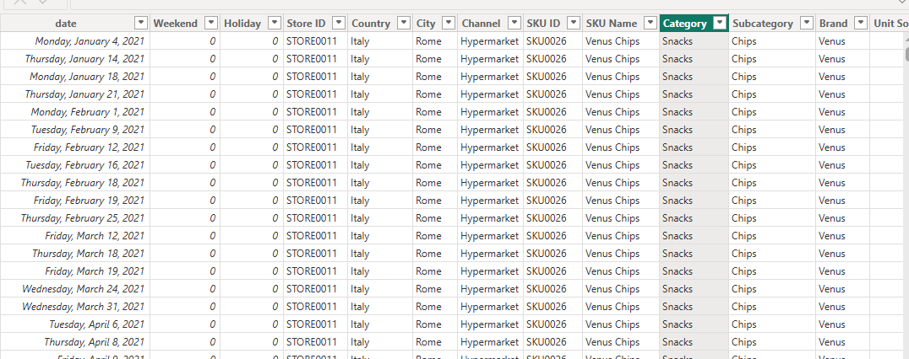

#  HarveyLynn Multinational Company (2021-2023)
## HarveyLynn is a multinational company operating across Western Europe, leveraging data-driven insights to evaluate performance across locations and support informed executive decision-making for sustainable growth.

## Executive Summary 
- Management requires a statistical narrative, supported by clear and reliable visuals, to gain a comprehensive understanding of business performance across units in Western Europe.
- An interactive Power BI dashboard was developed to address management’s key concerns, presenting essential KPIs such as Revenue, Gross Sales, and Net Sales, derived from a large-scale dataset exceeding 1 million records and 15+ columns.
- Delivered a centralized, data-driven solution that enables management to make informed and effective business decisions.
## The Business Problem
In addition to core KPIs, a data-driven approach is needed to understand weekday and weekend sales trends, city-level performance, brand contributions to revenue, and the most effective revenue-generating channels. 

### Key Questions Addressed:
- Developed essential KPI cards to monitor Revenue, Gross Sales, Net Sales, and other key performance metrics.
- Tracked the number of SKUs across the company’s five brands.
- Determined the sales volume that contributed to the revenue generated during the period under review.
- Tracked revenue generated by quarter for the period under review.
## The Process (Methodology)
### Tools Used:
Power BI, Power Query, DAX
### Data Sourcing & Overview
The dataset consists of 1 million transactions with 15+ columns, covering operations across all current regions.
### Data Cleaning & Transformation (ETL)
Using Power Query, the raw data was transformed to ensure accuracy:
- Removed duplicate entries from the dataset.
- Created a date table
- Removed all the nulls
- Created Net sales column
- Created Net Purchase column
- Created Sales Revenue column
  

## Analysis & Insights
This section breaks down the data into actionable stories.
### Breakdown Of Revenue Generated
- The highest revenue was generated in Milan and Rome, both located in Italy, with a combined total of $53M in revenue, the majority of which occurred on weekdays. Berlin followed as the second-highest revenue-generating city with $34M, while Barcelona ranked third with total revenue of $25M, also driven predominantly by weekday sales.
- Among the three distribution channels, Hypermarkets generated the highest revenue at $99M, followed by E-commerce with $42M, while Supermarkets ranked third with total revenue of $34M.
- Among the five brands of the business Claire,Venus and Nestla are the core sources of revenue generated within the period under review. Claire generated $36M, Venus generated $34M while Nestla generated $28M. 
- By product category, Snacks emerged as the top revenue driver with $47M in sales, followed by Beverages at $38M. Personal Care ranked third, generating $34M in revenue, while Dairy and Home Care placed fourth and fifth, contributing $32M and $24M respectively.
### Breakdown of Revenue generated by Promo Vs Revenue by Non-Promo
Nestla, Chicky, and Hollandia led promotional sales, generating $2.5M, $2.0M, and $1.8M respectively from the top three brands. Notably, these same brands also ranked highest in promotional sales in the previous year, maintaining the same order of performance.
### Breakdown of Gross sales by category current year vs previous year
Snacks, Beverages, and Personal Care were the primary sales drivers during the period under review, generating $129M, $104M, and $89M respectively across all regions. These product categories also maintained the same ranking in the previous year, indicating consistent performance over time.

## Recommendations
### Double Down on High-Performing Categories
Snacks, Beverages, and Personal Care consistently lead sales across periods.
#### Recommendation:
 Increase production capacity, shelf space, and promotional investment in these categories to sustain and scale revenue growth.
### Optimize Weekday Sales Momentum
Most revenue across cities and categories is generated during weekdays.
#### Recommendation:
 Align inventory planning, staffing, and logistics more heavily toward weekday demand while testing targeted weekend promotions to unlock untapped sales.
### Strengthen Presence in Top Revenue Cities
Milan and Rome dominate revenue generation, followed by Berlin and Barcelona.
#### Recommendation:
 Protect and grow market share in top cities through availability and pricing strategies, while replicating successful models in mid-performing cities.
### Leverage High-Impact Distribution Channels
Hypermarkets significantly outperform E-commerce and Supermarkets.
#### Recommendation:
 Prioritize partnerships, in-store promotions, and visibility in Hypermarkets, while improving digital marketing and delivery efficiency to scale E-commerce growth.
### Reinforce Proven Promotional Brands
Nestla, Chicky, and Hollandia consistently lead promotional sales year-over-year.
#### Recommendation:
 Focus promotional budgets on high-performing brands while piloting smaller, controlled promotions for emerging brands to test growth potential.
### Rationalize SKU Portfolio
SKU distribution across brands can impact operational efficiency.
#### Recommendation:
 Identify low-performing SKUs for consolidation and reinvest resources into high-velocity SKUs that drive volume and revenue.
### Maintain Centralized, Data-Driven Decision Making
The Power BI dashboard provides a single source of truth across regions and units.
#### Recommendation:
 Institutionalize dashboard usage in management reviews to enable faster, consistent, and data-backed decision-making.
## Link
[Interactive Power BI Link](https://app.powerbi.com/view?r=eyJrIjoiNzhhN2Q0MWItZTI0My00ZmM5LTk5N2EtZGJjZGZjODQ4NTU3IiwidCI6IjY0M2NkODIwLWU2YzYtNGI2ZC05ZDc5LTJjOTgwOTllMTg3MCJ9)
